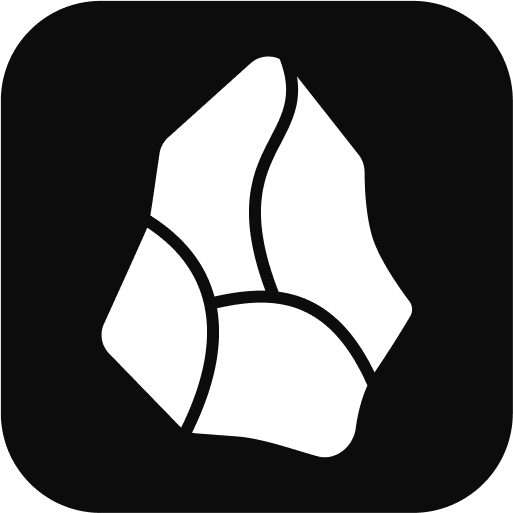

#  Obsidian - Advanced base for CS2 Cheat

<div align="center">
  
  
  
  
</div>

## 🚀 Features

### ESP (Extra Sensory Perception)

- **Player Boxes** - Draw boxes around players
- **Skeleton** - Show player bone structure
- **Health Bars** - Display player health
- **Names** - Show player names
- **Snaplines** - Draw lines to players
- **Glowing** - Make players glow (⚠️ **VAC Risk**)

### Combat

- **TriggerBot** - Automatic shooting when crosshair is on enemy
- **FOV Changer** - Modify field of view

### Miscellaneous

- **Watermark** - Display cheat information
- **OBS Bypass** - Hide cheat from streaming software
- **Multi-language Support** - 8+ languages supported

### Interface

- **Modern GUI** - Clean black and white interface
- **Acrylic Background** - Transparent blur effect
- **Always on Top** - Keep GUI above other windows
- **Customizable Binds** - Set your own hotkeys

## 🌍 Supported Languages

- 🇺🇸 English
- 🇷🇺 Russian
- 🇺🇦 Ukrainian
- 🇰🇿 Kazakh
- 🇫🇷 French
- 🇪🇸 Spanish
- 🇵🇱 Polish
- 🇩🇪 German

## 📋 Requirements

- Windows 10/11
- Python 3.8+
- Counter-Strike 2

## 🛠️ Installation

1. **Clone the repository**

   ```bash
   git clone https://github.com/zachey01/Obsidian.git
   cd Obsidian
   ```

2. **Install dependencies**

   ```bash
   pip install -r requirements.txt
   ```

3. **Run the cheat**
   ```bash
   python main.py
   ```

## ⚠️ Disclaimer

This software is for educational purposes only. Using cheats in online games may result in:

- **VAC (Valve Anti-Cheat) bans**
- **Account suspension**
- **Permanent game bans**

The author is not responsible for any consequences of using this software.

## 🤝 Contributing

Contributions are welcome! Please feel free to submit a Pull Request.

## 📄 License

This project is licensed under the MIT License - see the [LICENSE](LICENSE) file for details.

## 🙏 Credits

- PyMeow Community
- CS2 Dumper by a2x
- UnknownCheats

---

<div align="center">
  <b>⭐ Star this repository if you found it helpful!</b>
</div>
